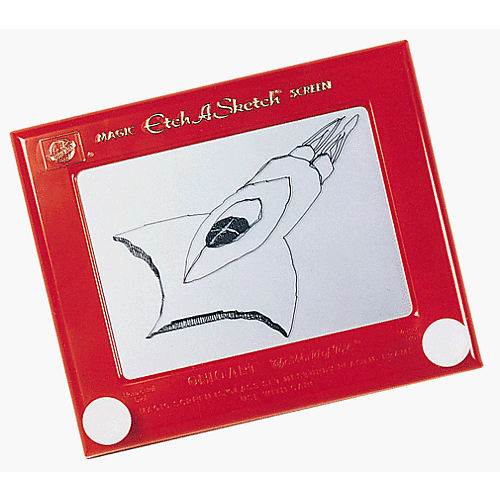

.. This document is Licensed Creative Commons:
   Attribution, Share Alike by Brad Miller, Luther College 2015

Event Driven Programming
========================

Many programs that we write in introductory computer science follow a similar pattern.  Your program starts at line 1 and runs to the end on line N.  The order of events in the program is quite predictable because Python evaluates the program top to bottom left to right.  But it doesn't have to be that way.  In fact nearly all of the programs you use daily have a different pattern.

Most of the programs you use each day following the pattern of start -- wait for the user to click something -- respond to click -- repeat forever.  This makes programming much more challenging because you can't predict the order that things will happen, your program simply must respond to **events**.  When you write a program that responds to user events this is called event driven programming.

Lets look at a simple example.  Suppose we want to write a turtle program where we have the turtle respond to a mouse click in the window.  That is, whenever a user clicks in the window, the turtle will draw a line to that spot.  Notice that we don't know when or where the user will click so we cannot anticipate where to draw the lines until the user has taken an action.

The big question in event driven programming is "how do we connect an event with our program?"  The answer goes by many names, handlers, callbacks, listeners, and others.  I prefer the term **callback.**  A callback is a piece of code (a function) that is passed as a parameter to another function which is then expected to call back the passed function at some later name.

For our example we will write a callback function called ``gotopoint`` which takes two parameters: the x and y location of where the mouse was clicked.  We will pass this function as a parameter to the ``onclick`` method provided by the turtle module.  Now the turtle module knows that whenever we click the mouse it must call our ``gotopoint`` function.  Furthermore, when it calls our function it will pass it the two parameters required to provide us with the x and y location of the mouse.  Connecting a function to an event like this is referred to as **binding** a function to an event.

.. activecode:: callbackdemo

   import turtle

   # Create our turtle and screen objects
   t = turtle.Turtle()
   wn = turtle.Screen()
   wn.setup(300,300)

   # define the callback   
   def gotopoint(x, y):
       t.goto(x,y)
    
   # connect the callback with the click event and wait
   wn.onclick(gotopoint)
   wn.listen()
   turtle.mainloop()

The turtle graphics module understands three main events

* onclick(fun)
* onkey(fun,key)
* ontimer(fun,millis)
* listen()  --  tell the screen to listen for key events

.. admonition:: Try it

   Modify the program above so that it has a callback function connected to the 'q' key.  The function that should be called is You may define your own function that takes no parameters and calls ``wn.bye()`` or you may bind ``wn.bye`` directly.
   
   Try modifying the above example to use ontimer.  Have your callback function pick a random point in the window and draw a line to it every 500 milliseconds.

   

Toys from the 60's
==================

The Etch-A-Sketch was introduced by the Ohio Art Company in 1960.  As you can see from the image, it has only two knobs that control the operation of the toy.  One for moving horizontal and the other for moving vertical.  To move at a diagonal required a bit of coordination between your right and your left hands.

.. activecode:: etch1

   import turtle

   myT = turtle.Turtle()
   wn = turtle.Screen()
   myT.color('blue')
   myT.pensize(2)
   myT.speed(0)

   distance = 5
   turn = 10

   def fwd():
       myT.forward(distance)

   def bkwd():
       myT.backward(distance)

   def left():
       myT.left(turn)

   def right():
       myT.right(turn)

   def quit():
       wn.bye()

   wn.onkey(fwd,"f")
   wn.onkey(bkwd,"b")
   wn.onkey(left,"l")
   wn.onkey(right,"r")
   wn.onkey(quit,"q")
   wn.listen()
   wn.mainloop()

Your assignment is to write a program that mimics the etch-a-sketch.  You will need functions to handle the following events:

* go to the left by five pixels
* go to the right by five pixels
* go up five pixels
* go down five pixels
* clear the screen (use ``reset``).

If you want to get fancy you can add some additional key events to change colors.  I will post the solution in a day or two.

.. index::  event driven, event loop